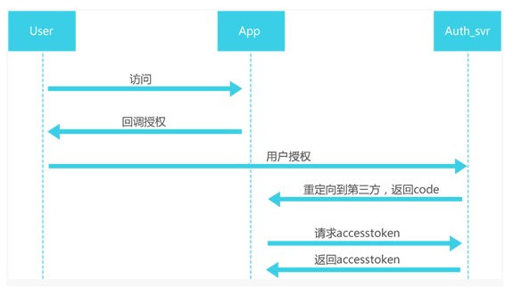

# 项目实战02微信支付宝服务号对接

微信公众号，支付宝服务号对接资料现在已经很多了。但当时资料很少的。

微信公众号是前辈开发的，我是进行二次开发。第一代开发主要集中在普通基金净值查询，不需要登录。后来微信提供了oauth2的认证，支持公众号提取到用户的更详细的信息，就可以通过公众号和用户账号建立绑定关系，从而实现用户查询资产，以及通过菜单中的网页链接登录h5形式的app，进行基金交易。

## OAUTH2
网页授权方式，需要用户点击确认下，但可以获取到用户更完整的信息。其实就是典型的**oauth2认证**。

只需要在菜单中配置网页地址就行了，跳转是微信自动进行的，进行过一次授权后，后台就可以获取到用户的个人信息，获取到用户的唯一id，后续用户进行绑定操作时就可通过唯一id和登录的公司的账号建立映射。

## 免登陆
用户第一次会通过h5页面登录到公司的简易版交易系统（同时后台建立用户id和内部账号的绑定关系）。后续进入h5页面时是不需要再次输入用户名密码的。但后台ctrl层执行业务逻辑时必然是需要用户登录信息的，这里就需要为用户进行一次“模拟登录”的操作，就是所谓的免登录。

其本质就是通过用户绑定关系，查询到用户个人信息，把**登录时填充的字段，塞到session中**，这样后续其他ctrl层操作，都和普通网页是一致的（主要是保持业务逻辑一致，否则就需要独立开发接口，进行各种数据校验等，service可能也需要为其定制，成本会变高）

## 如何更新菜单
通过flidder发送更新报文的，由于需要先获取授权码，所以需要操作2次，才能更新一次菜单，之所以没有开发独立功能，主要是这个功能的使用频率的确很低。由于post的报文是json格式的，所以更新前最好format下，注意层次关系，别更新错了。

目前关于微信公众号的开源工具已经烂大街了，借助开源工具可以很方便的实现这一点。

## 如何发布文章
微信公众号有个后台（微信官方的），可以发布文章，自动推送给关注的用户。

## 对接内部客服cms系统
微信消息直接对接公司的智能机器人（外包购入），如果输入“转人工”，则会将消息转发到公司内部的网页形式的客户服务系统的后台。这也是我在实习期的第一个项目。

主要是通过flidder抓包，分析后台客服系统的报文格式，进行socket模拟对接的。（主要是客服系统是买的，能用，但没源码，好在报文等都是明文）。客户输入转人工后，就模拟出一个”假人”，通过socket连接后台网页客服，由于socket可以持续保持，后续连接保证二者一一对应即可。（也就是微信id-socket连接的映射，类似一个中转站）。

最初采用轮询方式，挨个扫描socket，推送相关mesg，会有卡顿现象。后来改用多线程方式，每各socket对应一个线程，负责推送和转发消息，卡顿现象基本消失了。

但也面临一些问题，一个是微信的表情和网页客服表情无法一一对应，微信表情符其实是用特殊文本标识的，当时建立了一个map，保存这个映射（当然，只是一部分常用的），然后文本替换方式处理。

还有一个就是图片的推送。

## 支付宝服务号
这个当时支付宝有专人负责和我司对接的，这种大厂推出新服务时，为了招徕客户以及进行技术验证，都会拉一些各行业的top公司，进行前期合作。这样推出服务时，可以同时打出标杆客户，本身是双赢操作。

这个是我负责的，基本把微信做过的流程在走一遍，没有很大差别。不过支付宝服务号用户量的确不如微信。刚开始支付宝强推时还有些用户，后来用户就很少了。

## 遇到的坑
微信公众号做活动时，出过一次小事故。最后调查出是微信第一代代码中，有个wechatid的字段写成static了。导致用户的id串了。为了解决这个问题，我们熬了3个晚上，能找到的历史日志都挖出来，进行数据修复。

这个问题为啥之前没出现，主要是之前使用人少，所以出问题概率低，而且前期公众号基本没什么人用。后来用了h5的app，可以做抽奖等，用户量激增，并发量变大，并且用户使用公众号的也变多了，这个问题才暴露出来。

