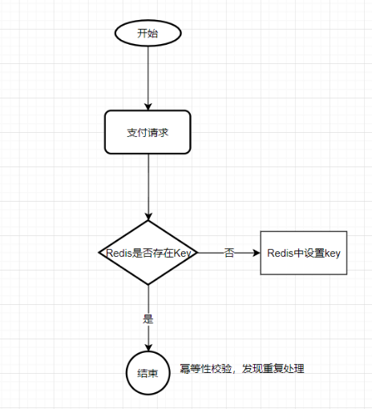

# 项目实战04请求幂等性
## 接口调用存在的问题
调用方收不到响应，无法区分请求没过来，还是已经处理过。但是无论哪种情况，都需要“找回对方响应的报文”（可能要根据响应，修改自身状态）

##  什么是接口幂等性
**任意多次执行所产生的影响均与一次执行的影响相同**，

接口幂等性就是用户对于同一操作发起的**一次请求或者多次请求的结果是一致**的，不会因为多次点击而产生了副作用。

## 什么情况下需要保证接口的幂等性
**必要性:重试是降低系统失败率的重要手段**。

互联网应用一般都是提供7*24服务的，而互联网应用本身又是快速迭代，后端系统是随时有可能需要进行发布的。**发布等同于一次宕机（进程被kill）**，这意味着对于互联网应用的后端系统，宕机是常态而非特例。这也是幂等性和重试的必要性来源之一。

对于业务中需要考虑幂等性的地方一般都是接口的重复请求，重复请求是指同一个请求因为某些原因被多次提交。导致这个情况会有几种场景：

**前端重复提交**：提交订单，用户快速重复点击多次，造成后端生成多个内容重复的订单。

**接口超时重试**：对于给第三方调用的接口，为了防止网络抖动或其他原因造成请求丢失，这样的接口一般都会设计成超时重试多次。

**消息重复消费**：MQ消息中间件，消息重复消费。

在增删改查4个操作中，尤为注意就是增加或者修改，

A: 查询操作

查询对于结果是不会有改变的，查询一次和查询多次，在数据不变的情况下，查询结果是一样的。select是天然的幂等操作

B: 删除操作

删除一次和多次删除都是把数据删除。(注意可能返回结果不一样，删除的数据不存在，返回0，删除的数据多条，返回结果多个,在不考虑返回结果的情况下,**删除操作也是具有幂等性的**)

C: 更新操作

修改在大多场景下结果一样,但是如果是增量修改是需要保证幂等性的,如下例子:

把表中id为XXX的记录的A字段值设置为1,这种操作不管执行多少次都是幂等的

把表中id为XXX的记录的A**字段值增加1**,这种操作就不是幂等的

D: 新增操作

**增加在重复提交**的场景下会出现幂等性问题,如以上的支付问题

## 幂等性实现方式
### Token机制
使用token机制实现:使用token机制实现接口幂等性,通用性强的实现方法

token特点:要申请，一次有效性，可以限流

### 数据库去重表(唯一索引)
往去重表里插入数据的时候，利用数据库的唯

一索引特性，保证唯一的逻辑。唯一序列号可以是一个字段，例如订单的订单号，也可以是多字段的唯一性组合。

代码方法：提供幂等性校验的接口方法

这个接口的方法具体在项目中合理的使用就看项目要求了，可以通过@Autowire注解注入到需要使用的地方，但是缺点就是每个地方都需要调用。我个人推荐的是**自定义一个注解，在需要幂等性保证的接口上加上该注解，然后通过拦截器方法拦截使用**。这样简单便不会造成代码侵入和污染。

另外，使用数据库防重表的方式它有个严重的缺点，那就是系统**容错性不高，如果幂等表所在的数据库连接异常或所在的服务器异常**，则会导致整个系统幂等性校验出问题。如果做数据库备份来防止这种情况，又需要额外忙碌一通了啊。

### Redis实现
Redis实现的方式就是将唯一序列号作为Key，唯一序列号的生成方式和上面介绍的防重表的一样，value可以是你想填的任何信息。唯一序列号也可以是一个字段，例如订单的订单号，也可以是多字段的唯一性组合。当然这里需要设置一个 key 的过期时间，否则 Redis 中会存在过多的 key。

### 状态机
对于很多业务是有一个业务流转状态的，每个状态都有前置状态和后置状态，以及最后的结束状态。例如流程的待审批，审批中，驳回，重新发起，审批通过，审批拒绝。订单的待提交，待支付，已支付，取消。

以订单为例，已支付的状态的前置状态只能是待支付，而取消状态的前置状态只能是待支付，通过这种状态机的流转我们就可以控制请求的幂等。

### 乐观锁和悲观锁也是幂等的解决方案么？
还有些文章把乐观锁和悲观锁也放到幂等的解决方案中了，个人**并不认同这种解释**。

乐观锁和悲观锁是为了解决高并发下的**数据混乱问题**的，和接口幂等和高并发并没有必然联系。**即使一个接口一天只调用一次，也会面临幂等问题**。把昨天一模一样的报文发送给你（唯一序列号相同-对应同一个已支付订单的付款操作），你怎么响应的问题（这个是和业务关联的，个人工作经历，把昨天响应的报文再次resp一次，告诉支付成功，支付时间-昨天。有人就会抬杠了，应该响应支付失败吧，毕竟成功的是昨天的，而不是刚刚的）。

## 参考
接口的幂等性:https://www.cnblogs.com/huaixiaonian/p/9577567.html

分布式系统中接口的幂等性:https://www.cnblogs.com/jajian/p/10926681.html

使用数据库唯一键实现事务幂等性:https://www.caosh.me/be-tech/idempotence-using-unique-key/

高并发下接口幂等性解决方案:https://blog.csdn.net/u011635492/article/details/81058153

分布式系统接口幂等性：https://nicky-chen.github.io/2018/03/26/interface-idempotency/

