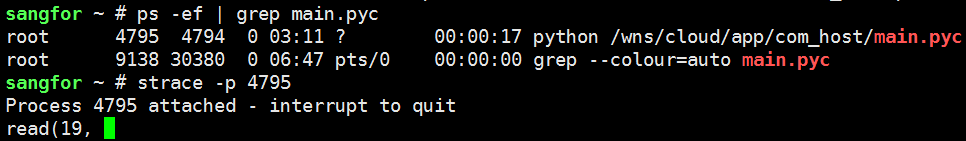
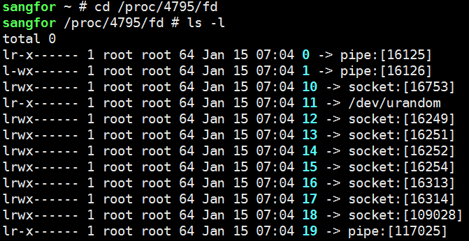

# 项目实战07线上问题定位之自上而下
## 查看进程下线程和资源占用

```
使用ls /proc/pid/task/ 查看线程
使用ps -eLf命令/ps aux -L/ps aux -el
使用pstree 
```
查看线程数量

```
cat /proc/19135/status | grep Threads
pstree -p 19135|wc -l
```

## 程序状态字段解释
D    Uninterruptible sleep (usually IO) 不可中断睡眠

R    Running or runnable (on run queue) 正在执行或可执行，表示目前在运行队列里面

S    Interruptible sleep (waiting for an event to complete) 可中断睡眠

T    Stopped, either by a job control signal or because it is being traced.停止

W    paging (not valid since the 2.6.xx kernel)

X    dead (should never be seen)

Z    Defunct ("zombie") process, terminated but not reaped by its parent.僵尸进程


## 查看各进程下的线程数情况
比如某台服务器的CPU使用率飙升，通过top命令查看是gitlab程序占用的cpu比较大，"ps -ef|grep gitlab"发现有很多个gitlab程序，现在需要查询gitlab各个进程下的线程数情况。批量查询命令如下：
```
# for pid in $(ps -ef|grep -v grep|grep gitlab|awk '{print $2}');do echo ${pid} > /root/a.txt ;cat /proc/${pid}/status|grep Threads > /root/b.txt;paste /root/a.txt /root/b.txt;done|sort -k3 -rn
```

## 查看cpu使用率告警问题处理案例

查出这个pid进程的cpu资源各自被哪个线程所占。通过"top -Hp pid"可以查看该进程下各个线程的cpu使用情况；如下：

```
[root@kevin ~]# top -Hp 31969
# 另方式查看子线程：ps -Lf 31969
```
通过top命令定位到cpu占用率较高的线程之后，继续使用jstack pid命令查看当前java进程的堆栈状态，这就用到jstack工具！
jstack是java虚拟机自带的一种堆栈跟踪工具。jstack用于打印出给定的java进程ID或core file或远程调试服务的Java堆栈信息。
jstack可以定位到线程堆栈，根据堆栈信息我们可以定位到具体代码，所以它在JVM性能调优中使用得非常多。


## 程序卡主跟踪
继续用strace -p 27678跟踪，发现卡在read，文件描述符是14




现在我们查看一下进程打开的文件描述符14代表什么，pipe文件




其实在这里我们也可以使用lsof来定位，可以看到进程27678打开的FD 14是pipe，这里u代表可读可写，r代表可读

```
sangfor ~ # lsof -d 14
COMMAND     PID USER   FD   TYPE             DEVICE SIZE/OFF     NODE NAME
mongod     1907 root   14u   REG              251,0    36864   130683 /wns/data/mongodb/db/collection-7--588642557116981989.wt
syslog-ng  3446 root   14u  unix 0xffff88012227d800      0t0 40557736 /dev/log
dockerd    4025 root   14u  unix 0xffff8800b8d5d800      0t0    13941 /run/docker/libnetwork/a73bd949b5fbb89c2b8bec3b4ac6af0a948a944958c8b037d9e6c9b324b44331.sock
docker-co  9382 root   14u  0000                0,9        0     9553 anon_inode
docker-co 21204 root   14u  0000                0,9        0     9553 anon_inode
python    27678 root   14r  FIFO                0,8      0t0 38483750 pipe
```

也可以直接查看进程27678打开的，可以看到14是pipe

```
sangfor ~ # lsof -p 27678
COMMAND   PID USER   FD   TYPE             DEVICE SIZE/OFF     NODE NAME
python  27678 root    0r  FIFO                0,8      0t0 30690124 pipe
python  27678 root    1w  FIFO                0,8      0t0 30690125 pipe
python  27678 root    2w  FIFO                0,8      0t0 30690126 pipe
python  27678 root    3u  0000                0,9        0     9553 anon_inode
python  27678 root    4u  0000                0,9        0     9553 anon_inode
python  27678 root    5u  pack           30691718      0t0  unknown type=SOCK_RAW
python  27678 root    6w   REG              251,0 76106652   130565 /wns/data/com_host/etc/config/err.log
python  27678 root    7u  IPv4           30691716      0t0      TCP Sangfor:53102->Sangfor:42457 (ESTABLISHED)
python  27678 root    8u  IPv4           30691717      0t0      TCP Sangfor:42457->Sangfor:53102 (ESTABLISHED)
python  27678 root    9u  IPv4           30691731      0t0      TCP db.sdwan:54072->sdwan.io:27017 (ESTABLISHED)
python  27678 root   10u  IPv4           30691732      0t0      TCP db.sdwan:54074->sdwan.io:27017 (ESTABLISHED)
python  27678 root   11r   CHR                1,9      0t0 30690329 /dev/urandom
python  27678 root   12u  IPv4           30719611      0t0      TCP db.sdwan:51404->db.sdwan:37017 (ESTABLISHED)
python  27678 root   13u  IPv4           30719610      0t0      TCP db.sdwan:47124->db.sdwan:27017 (ESTABLISHED)
python  27678 root   14r  FIFO                0,8      0t0 38483750 pipe

```
## 参考
如何区分进程和线程ps -eLf：https://www.cnblogs.com/shengulong/p/11498437.html

如何查询一个进程下面的线程数（进程和线程区别）：https://www.cnblogs.com/kevingrace/p/5252919.html

用strace查找进程卡死原因：https://blog.csdn.net/peng314899581/article/details/79064616

